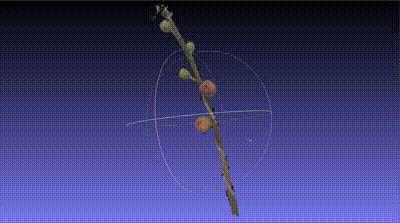
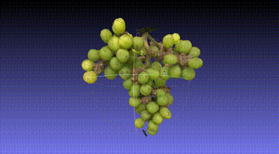
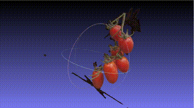

# GRAPE: High-fidelity 3D Gaussian Reconstruction for Agricultural Plant Entities
## 📖 Abstract
Plant phenotyping analysis is a crucial task in agricul-
tural research, aiming to measure plant morphological data
using tools such as calipers and radars. However, tradi-
tional methods generally struggle to accurately capture the
surface textures and structural features of plants. In this pa-
per, we propose a unified architecture to reconstruct high-
fidelity 3D surface models and render realistic plant views,
which enhances geometric accuracy during Gaussian den-
sification and mesh extraction from 2D images. First, we
apply semantic segmentation with large language models
to extract plant objects from 2D RGB images, generating
sparse mappings and camera poses. These images and
point clouds are then processed to produce Gaussian el-
lipsoids and 3D textured models, with our method detect-
ing smooth regions during densification. To ensure precise
alignment of Gaussians with object surfaces, our robust 3D
Gaussian splatting method includes an outlier removal al-
gorithm, produces more accurate models with less noise
than traditional techniques. Experimental results demon-
strate that our method outperforms existing plant modeling
approaches, surpassing the NeRF-based method instant-
NGP and the 3DGS-based surface modeling method SuGaR
in terms of PSNR, LPIPS, and SSIM metrics. 

<div align="center">



</div>

*GRAPE(Ours)'s mesh results on GRAPE datasets. *


## 🔧 Setup of GRAPE
### 1. Clone the repo.
```
# https
git clone https://github.com/DYH200009/GRAPE
# or ssh
git clone git@github.com:DYH200009/GRAPE.git
```

### 2. Environment setup.
If you have an environment used for 3dgs, use it. 
If not, please refer to the environment configuration of [3DGS environment](https://github.com/graphdeco-inria/gaussian-splatting?tab=readme-ov-file#local-setup) 
The ``environment.yml`` file for 3DGS has been provided in our repo.

Additionally, you also need to install the 
``open3d`` ``scipy`` ``matplotlib`` ``pillow``
libraries.

```
# If you have already installed the 3dgs environment,
# please activate the environment and execute the following command :
conda activate gaussian_splatting
pip install open3d scipy matplotlib pillow
cd submodules/diff-gaussian-rasterization/
pip install -e .
cd ../simple-knn/
pip install -e .
cd  ../../
```
In addition, you need to install SuGaR's running environment separately 
If you have an environment used for SuGaR, use it. 
If not, please refer to the environment configuration of [SuGaR environment](https://github.com/Anttwo/SuGaR?tab=readme-ov-file#installation) 

### 3. Download the demo dataset
- Create a new ``data`` folder
- Download the file ([GRAPE-Dataset](https://drive.google.com/file/d/153DR5sdkT8pJUXNnMED4pkLfhWcas4MW/view?usp=sharing)).
- Unzip it to ``data`` folder.

### 4. Run the codes 
In order to run our code, 
```
# python train.py -s [path_to_dataset] -m [path_to_output] --eval
# cd MeshExtractor
# python train.py -s [path_to_dataset] -r <"density" or "sdf"> -c [path_to_output]
```
Run demo:
```
python train.py -s data/GRAPE/grape -m outputCKT/grape 
cd MeshExtractor
python train.py -s data/GRAPE/grape -r density -c outputCKT/grape 
```


## ⭕️ Acknowledgment
This project is based on [GeoGussian](https://github.com/yanyan-li/GeoGaussian) and [SuGaR](https://github.com/Anttwo/SuGaR) 
Thanks for the contribution of the open source community.


<!-- ## ✉️ Citation
If you find this project useful in your research, please consider cite:

*BibTex*
```
@article{li2024geogaussian,
  title={GeoGaussian: Geometry-aware Gaussian Splatting for Scene Rendering},
  author={Li, Yanyan and Lyu, Chenyu and Di, Yan and Zhai, Guangyao and Lee, Gim Hee and Tombari, Federico},
  journal={arXiv preprint arXiv:2403.11324},
  year={2024}
}
``` -->
